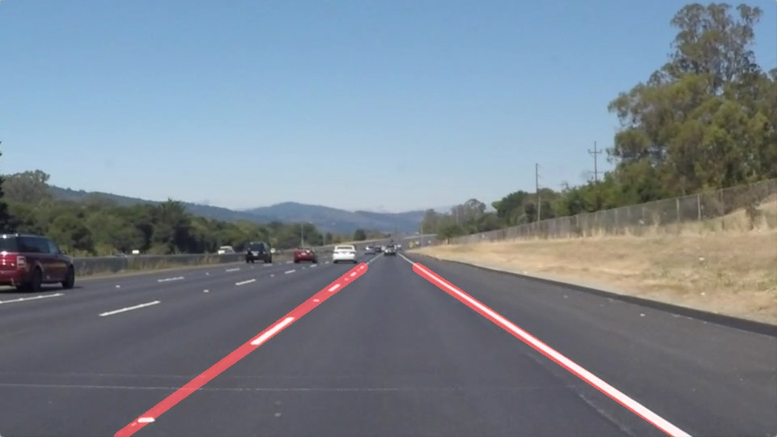

Furkan Çetin - 16/11/2020

# Project #1: Finding Lane Lines on the Road

## WriteUp

This project aims to detect lane lines on the road by applying some filters to images. Being the first project of Udacity Self-Driving Car Engineer Nanodegree programme, it was so helpful and well prepared for us, students, to practice the course content. On the other hand, the project allowed me to practise and get used to coding in Python.


<figure>
 
 <figcaption>
 <p></p> 
 <p style="text-align: center;"> One of the outputs of the code </p> 
 </figcaption>
</figure>

When achieving this goal, OpenCV libraries are used along with other libraries like matplotlib and numpy. Thanks to the functions in those libraries, it's so easy and efficient to build an actual working code that can be used in real life applications. Here are the imported libraries:


```python
#importing some useful packages
import matplotlib.pyplot as plt
import matplotlib.image as mpimg
import numpy as np
import cv2
import os
```

After importing useful resources, the main body of the code includes file readings and application of filters. For the images, all the image files included in <test_images> folder are imported and displayed with detected lane lines.


```python
#Listing images 
list_images_names = os.listdir("test_images/")

for img_name in list_images_names:
    img_input = cv2.imread(r'test_images/'+img_name)
    img_output = process_image(img_input)
    plt.imshow(img_output[...,::-1])
    plt.show()
    cv2.imwrite(r'test_images_output/Output_'+img_name, img_output)
```

All of the required filtering functions are included in the function called <process_image(img_input)>. This function requires an image object as an input parameter and returns another image object same as the input image with detected lanes drawn on it with red color. Here is the pipeline implemented for the detection of lane lines:


1- GreyScale: Input image is converted from BGR color space to Grey scale to detect later on the brightness changes between pixels 

2- Blurring: To get better resuts, this blurring step is an optional to use before Canny algorithm (which makes blurring already at some level)

3- Canny algorithm: For edge detection and feature extraction, Canny is a great and commonly used tool. 

4- Region Masking: To get better results and increase performance, this functions crops the images so that every pixel is not considered for further algorithms.

5- Hough Transformation: Hough Transformation is used to convert huge pixel data (remained as a result of Canny Algorithm) into contour data made of lines which is simpler to work with.

6- Detecting points: Here, remaining of line data is seperated according to being belong to right or left lane. We use a vertical line as a threshold and compare all points of lines according to that vertical line.

7- Curve Fitting: At the end, a simple line is generated out of the many points data so that we achieve final, clean representative line for the actual lane lines on the road

8- Final: The function returns an image that is combination of the input image with lane lines drawn on it


```python
def process_image(image_input):
    # x coordinate of vertical line located at the center 
    mid_vertical_x = 485
    
    # point list of the polygonal area on image where we want to apply our filters
    region_coordinates =[[(110,540), (950,540), (550,330), (420,330)]]   

    # Convert image into gray scale
    image_grey = cv2.cvtColor(image_input,cv2.COLOR_RGB2GRAY)
    
    # Add images extra blurring
    image_grey_blurred = cv2.GaussianBlur(image_grey,(5, 5),0)
    
    # Apply Canny algorithm for edge detection 
    image_canny = cv2.Canny(image_grey_blurred, 40, 100)

    # Crop the images with polygonal region
    mask = np.zeros_like(image_canny)    
    vertices = np.array(region_coordinates, dtype=np.int32)
    cv2.fillPoly(mask, vertices, 255)
    image_masked_edges = cv2.bitwise_and(image_canny, mask)

    # Apply Hough Transformations
    lines = cv2.HoughLinesP(image_masked_edges, 2, (np.pi)/180, 15, np.array([]),40, 20)
  
    # Draw final lines onto the image
    xLeft  = []
    yLeft = []
    xRight  = []
    yRight = []  
    
    
    for line in lines:
        for x1,y1,x2,y2 in line:
            # check for the FIRST point of HoughLines list 
            if (x1 < mid_vertical_x): # that means the point is on the LEFT lane
                xLeft.append(x1)
                yLeft.append(y1)
            else:                     # that means the point is on the RIGHT lane
                xRight.append(x1)
                yRight.append(y1)
                    
            # check for the SECOND point of HoughLines list       
            if (x2 < mid_vertical_x): # that means the point is on the LEFT lane
                xLeft.append(x2)
                yLeft.append(y2)
            else:                     # that means the point is on the RIGHT lane
                xRight.append(x2)
                yRight.append(y2)

    
    # Find average of all the points on both lanes and fit a line onto them
    blank_canvas = np.zeros(image_input.shape, np.uint8)

    [slope, intercept] = np.polyfit(xLeft, yLeft, 1)
    startY = 330
    endY = 540
    startX = int( (startY - intercept) / slope)
    endX = int((endY - intercept) / slope)
    cv2.line(blank_canvas,(startX,startY),(endX,endY),(0, 0, 255) ,11) # Red Line for LEFT Lane  [(B,G,R) standart for OpenCV]
    
    [slope, intercept] = np.polyfit(xRight, yRight, 1)
    startY = 330
    endY = 540
    startX = int( (startY - intercept) / slope)
    endX = int((endY - intercept) / slope)
    cv2.line(blank_canvas,(startX,startY),(endX,endY),(0, 0, 255) ,11)  # Red Line for RIGHT Lane  [(B,G,R) standart for OpenCV]
    
    image_result = cv2.addWeighted(image_input, 1.0, blank_canvas, 0.5, 0)
    
    # Return the final image that consists the input image with detected lane lines
    return image_result
```

## Detection of Lane Lines on Video

A video is simply a group of images played continually. Therefore, our function process_image is also helpful for detecting lane lines in images of videos. Here is the simple main body function which uses process_image function again, to detect lane lines and exports the input videos with the detected lines visible in red.


```python
# Import everything needed to edit/save/watch video clips
from moviepy.editor import VideoFileClip
from IPython.display import HTML

white_output = 'test_videos_output/solidYellowLeft.mp4'
clip1 = VideoFileClip("test_videos/solidYellowLeft.mp4")
white_clip = clip1.fl_image(process_image)
%time white_clip.write_videofile(white_output, audio=False)
    
white_output = 'test_videos_output/solidWhiteRight.mp4'
clip1 = VideoFileClip("test_videos/solidWhiteRight.mp4")
white_clip = clip1.fl_image(process_image)
%time white_clip.write_videofile(white_output, audio=False)
```

## Shortcomings of the code

Firstly, this code is written for the specific pictures and the videos given in the project. Here are the parameters that could differ for different situations when using this code with other inputs or in real life applications:

1- Region masking is applied according to a four-cornered-polygon which is chosen common for the input files and hard-coded into code.

2- In real life applications, defined region masking could work on straight rodes. However, for inclinations on the road and on the curves, It should be modified dynamically for each cases.

3- Instead of looking for white color on the screen pixesls, we used Canny algorithm which results much better. However, using those constant values in the code may not give satisfying results under different light conditions or diffrent road darkness changes.

4- For the video challenge.mp4, the code doesn't work well. It needs different parameters for region mask and filtering algorithms. For the curves, shadows on the road and various road darkness levels, code could be written to be more adaptive to the changes. Also, extra filtering (like Kalman filters) can be used for better results. 

5- Memory performance is not optimized

## Improvements 

1- In some cases, lane lines may not be so visible to be identified by the algorithms maybe for momentarily. In those cases, algorithm could be improved to be more robust

2- To detect future curves when driving forward, another interesting approach could be using 2 different region masking and detecting lane lines for the area close to the car and also for the horizon (far to the car). Therefore car could be driven according to the closer lane lines but also could understand the next change on the road wheather its a curved or straight road.

3- For curvatures, polygon fitting function may be modified for fitting 3rd order polygon to the point data after Hough Transformations

4- After Hough Transformations, for each line, both points are considered to find final line for lanes. For performance improvements, taking only one of the points ( (x1,y1) or (x2,y2) ) can give very similar results
